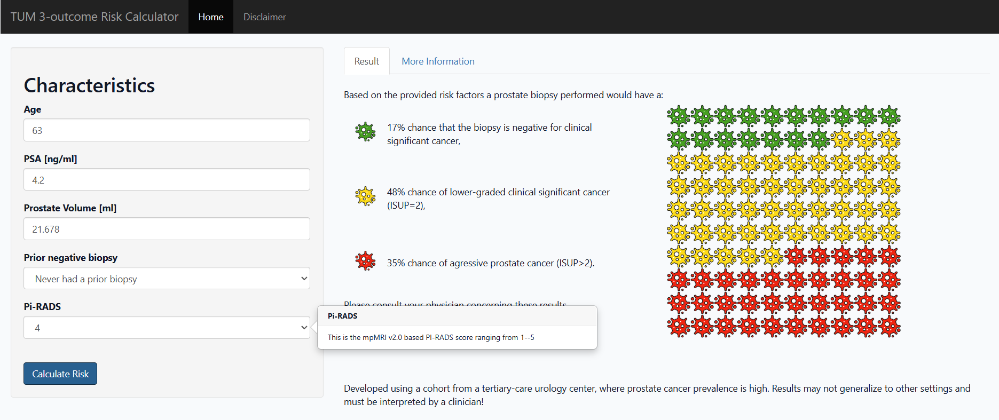

# 3-Outcome PCa Risk Calculator (R Shiny Prototype)

  
*Screenshot of the Shiny prototype interface.*

An **R Shiny** prototype for MRI-based prostate cancer risk prediction using a 3-outcome multinomial logistic regression model with the outcome groups:
**no-csPCa (ISUP < 2)**, **ISUP = 2**, and **aggressive PCa (agPCa; ISUP > 2)**.

Developed as part of my **B.Sc. thesis in Mathematics** at the Technical University of Munich (TUM) (final thesis grade: 1.3) in collaboration with a tertiary urology center in Munich.

---

## Highlights
- Interactive **R Shiny** risk calculator prototype (runs locally).
- **Interpretable baseline model**: multinomial logistic regression with clinically meaningful outcome groups.
- **Systematic model development** (multiple candidate specifications + comparative evaluation; documented in the thesis) leading to the parsimonious final model used in the app.
- **Internal (development-stage) evaluation** via **8-fold cross-validation** (primary) plus an additional **train/test split** (secondary).

---

## Internal evaluation (what was done)
This repository focuses on the Shiny prototype. During thesis work, the underlying model was additionally assessed using:
- **Discrimination:** ROC curves and AUC (e.g., agPCa AUC ≈ **0.78**, depending on the internal evaluation approach).
- **Calibration:** basic calibration assessment using **calibration curves**.
- **Exploratory threshold check:** a fixed risk cut-off analysis to quantify errors such as **false negatives**.

> Note: This is not a full clinical validation. Due to the limited effective sample size and single-center setting, results reflect a pragmatic internal evaluation for model development; external validation is required.

---

## Data, results & limitations
- No clinical dataset included in the repo, as the original dataset is legally restricted and cannot be shared.
- **Cohort size:** after applying exclusion criteria, the analytical cohort comprised 677 patients, with 600 complete cases used for the final model after removing missing values.
- **Generalizability:** results are based on a single tertiary-care / higher-risk cohort and should be interpreted as development-stage evidence.
- **External validation required:** before any routine or clinical use, the model must be validated on independent cohorts.

---

## Run locally
1. Clone this repository.
2. Open the project in your preferred R environment (e.g., RStudio or VS Code with an R extension).
3. Launch the app, for example:
   - `shiny::runApp()`

---
